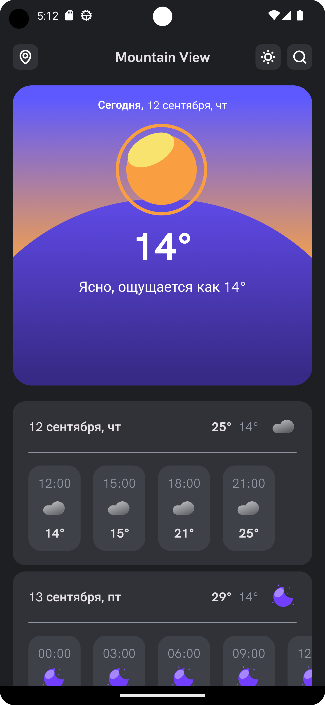
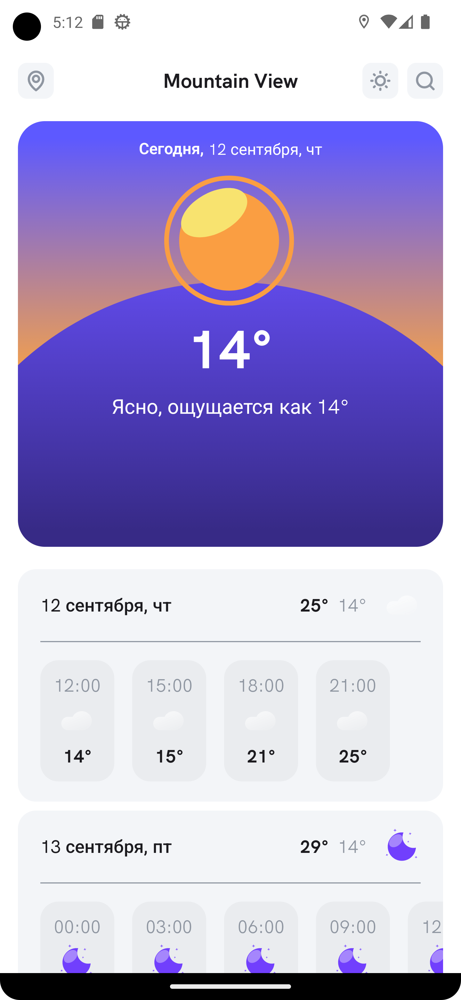
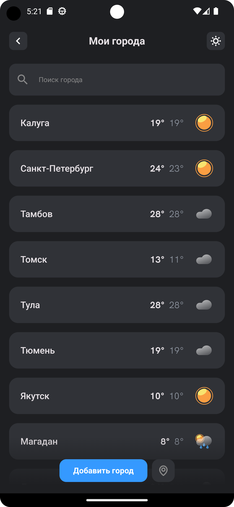
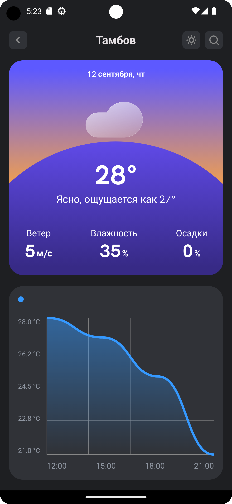

# A program written entirely in Kotlin using the principles of Clean Architecture and Multi Modularity according to the MVI pattern.

This weather application is written in Kotlin using the Jetpack Compose framework. It allows you to
detect the weather in any place on Earth. The app includes a map screen where you can view all
cities and their current weather. There is also a search screen where you can find any city by name,
view its weather forecast, and save it to favorites for quick access in the future.

## ScreenShots

## Libraries

* [Jetpack Compose](https://developer.android.com/jetpack/compose) Jetpack Compose is Android’s
  recommended modern toolkit for building native UI. It simplifies and accelerates UI development on
  Android. Quickly bring your app to life with less code, powerful tools, and intuitive Kotlin APIs.

* [Google Maps](https://developers.google.com/maps/documentation?hl=ru)
  is a comprehensive mapping
  platform provided by Google, widely used in mobile and web
  applications. It allows developers to integrate interactive maps, location services, and
  geospatial
  data into their applications. With Google Maps, you can display custom maps, add markers, plot
  routes, and provide location-based services. The API also supports features like geocoding,
  reverse geocoding, traffic data, and street view. It is commonly used in Android and iOS apps for
  location tracking, navigation, and visualizing geographic information.

* [Kotlin flows](https://developer.android.com/kotlin/flow) In coroutines, a flow is a type that can
  emit multiple values sequentially, as opposed to suspend functions that return only a single
  value. For example, you can use a flow to receive live updates from a database.

* [Kotlin Coroutines](https://github.com/Kotlin/kotlinx.coroutines) Coroutines is a rich library for
  coroutines developed by JetBrains. It contains a number of high-level primitives with support for
  coroutines, which are discussed in this guide, including startup, asynchrony, and others.

* [ViewModel](https://developer.android.com/topic/libraries/architecture/viewmodel) Data related to
  the user interface that is not destroyed when the application is rotated. Easily schedule
  asynchronous tasks for optimal execution.

* [Lifecycle](https://developer.android.com/topic/libraries/architecture/lifecycle) An interface
  that automatically responds to lifecycle events.

* [Retrofit](https://developer.android.com/codelabs/basic-android-kotlin-compose-getting-data-internet#0)
  This is
  a library for working with the REST API in Android. It makes it easy to interact with the server
  and execute HTTP requests.
  The library itself creates the necessary classes for executing requests and processes responses.

* [Dagger2](https://dagger.dev/) is a powerful Dependency Injection (DI) library for Java and
  Kotlin,
  widely used in Android development. Developed by Google, Dagger2 enables efficient dependency
  management and improves code modularity by automating the process of providing and injecting
  dependencies.
  Unlike other DI frameworks, Dagger2 generates code at compile time, making it more performant by
  reducing runtime overhead.
  It allows developers to easily define and manage
  dependencies in large-scale applications, ensuring clean architecture and testable code.

* [Room](https://developer.android.com/training/data-storage/room) Room is a library for working
  with
  databases that provides strict validation at the compilation stage and reduces the likelihood of
  errors during application execution